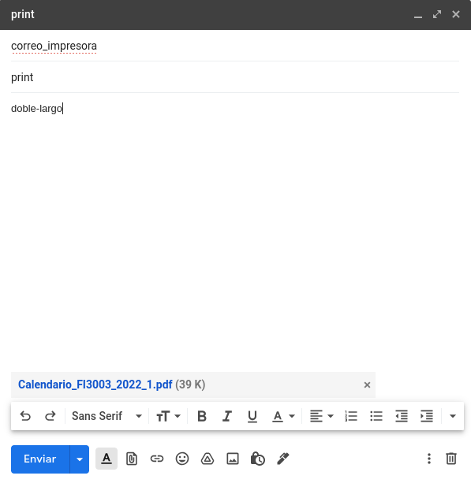

# Servicio para imprimir

## Instalación

Para intalar el servicio, basta con agregar el archivo de servicio y seguir las instrucciones de [aquí](https://gist.github.com/emxsys/a507f3cad928e66f6410e7ac28e2990f)

Notar que en el archivo service hay que cambiar el path de python por el virtualenv y el argumento por la dirección de este directorio.

## Uso

Al nivel más básico, a la fecha existen dos tipos de usuarios: usuarios normales y administradores. Los correos se configuran en el archivo email_list.json que si no existe hay que crear y tiene la siguiente estructura

```json
{"users": ["xxxx@xxxx.xxxx", ...], "admins": ["xxxxx@xxxxx.xxxxx", ...]}
```

### Usuarios normales

Estos usuarios cuentan con un solo comando, este es el comando ``print``. Para usar el comando basta con enviar un correo con el asunto igual al comando. Las opciones disponibles que basta que estén en el cuerpo del correo, en cualquier órden son:

+ ``doble-largo``: imprime el archivo adjunto a doble cara por el borde largo (opción por defecto)
+ ``doble-corto``: imprime el archivo adjunto a doble cara por el borde corto
+ ``pgs [a-b]``: imprime desde las páginas ``a`` a la ``b`` inclusicos


En caso de no especificar se asume que se quieren todas las páginas solo una cara.

estos comandos se pueden mezclar mientras no sean expluyentes.

Ejemplo de uso:



En este ejemplo vemos que se imprimirá el documento "Calendario_FI3003_2022_1.pdf" a doble cara con borde largo. Edit: AHORA EL BORDE LARGO DOBLE CARA ES DEFECTO, NO HACE FALTA MANDAR NINGÚN COMANDO.

